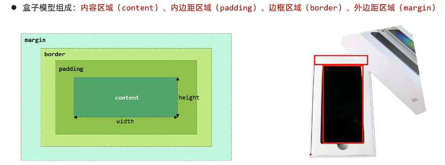

# Java（一）、HTML with CSS

## XHTML 标准

### 文档格式

XHTML 可以视为一种增强的 HTML 语言，发明原因是一些前端工程师写的 HTML 不够规范。本教程所教学的实际上是 HTML。

XHTML 要求每篇文档需要按照以下格式书写：

```html
<!DOCTYPE html> <!-- 文档类型声明 -->
<html lang="en">    <!-- 文档语言声明 -->
<head>
    <meta charset="UTF-8">  <!-- 指定文档字符集 -->
    <meta name="viewport" content="width=device-width, initial-scale=1.0">
    <title>你指定的标题</title>

    <!-- 其它设置写在这里 -->

</head>
<body>
    <!-- 文档主体内容 -->
</body>
</html>
```

而 XHTML 元素指的就是用尖括号包裹起来的内容（实际上也是 HTML 标签），XHTML 属性也被包括在尖括号内，并且和元素标识符用空格隔开：

```html 
<table width="100%">
```
> table 元素，width 属性

`<head>` 标签中用于定义一些配置和导入代码，`<body>` 标签中用于定义 HTML 的主体部分。

### 编写规范

XHTML 文档必须遵循以下编写规范：

- XHTML 元素必须正确嵌套。
- XHTML 元素必须始终关闭。
- XHTML 元素标识符必须小写。
- XHTML 文档必须有一个根元素。
- XHTML 属性标识符必须小写。
    > wrong：`<table Width="100%">`
- XHTML 属性值必须引号包围。
    > wrong：`<table width=100%>`
- 不允许只写属性标识符而不进行赋值。
    > wrong：`<table width>`


## HTML 基础标签

### 标题标签

用 `<h1>` 到 `<h6>` 来表示标题：

```html 
<h1>header1</h1>
<h2>header2</h2>
<h3>header3</h3>
```

### 水平线标签

直接使用 `<hr>` 标签表示水平线。

### 图片标签

使用 `` 标签来表示图片。`img` 标签有三个可选属性（属性都是一并写在尖括号中）：

- `src`：相对路径、绝对路径或是网络路径
- `width`：宽度
- `height`：高度

宽度和高度仅指定其中一者则等比例缩放。

### 段落标签

用 `<p>` 标签表示段落

```html
<p>
段落内容
</p>
```

### 换行标签

用 `<br />` 表示换行。

### 超链接标签

用 `<a>` 标签定义超链接，通过 `href` 属性来指定目标跳转网站：

```html
<a href="http://www.w3school.com.cn">This is a link</a>
```

## HTML 样式设置

设置 HTML 样式有三种方式：

> 以下样式的写法涉及 CSS 语法，上面已经一些最基本的 CSS 语法，这里建议可以先移步到下文的 [CSS 语法概述](#css-语法概述) 了解一些基本的 CSS 语法样式。

### 行内样式

直接写在标签的 style 属性中：

```html
<p style="color: red; margin-left: 20px">
This is a paragraph
</p>
```

### 内嵌样式

先在 `<head>` 标签内部的定义 `<style>` 标签，这种方式能够实现对文档中标签的批量控制，如下：

```html
<head>
......
    <style>
        p {
            text-align: center;
            color: red;
        }
    </style>
</head>
```


这里涉及到选择器的概念，选择器是用来选取要设置样式的 HTML 标签：

#### 元素选择器

元素选择器根据元素名称来选择 HTML 元素。写法是直接写元素标签的标识符：

```html 
p {
    text-align: center;
    color: red;
}
```

花括号中的样式设置将会对所有 `<p>` 标签作用。

元素选择器也可以作用在多个元素上，比如我们对 `<p>`、`<h1>` 和 `<h2>` 标签的样式设置都是一样的，可以采用以下代码执行：

```html 
h1, h2, p {
  text-align: center;
  color: red;
}
```

#### ID 选择器

ID 选择器用 `#` 符号开头，然后跟上目标 ID 的标识符：

```html 
#target_id {
    text-align: center;
    color: red;
}
```

花括号中的样式设置将会对所有将 `id` 属性设置为 `"target_id"` 值的 HTML 元素作用。

所谓 `id` 是 HTML 标签的属性之一，可以用如下方式指定：

```html 
<h1 id="my_id">...</h1>
```

#### 类选择器

类选择器用 `.`，然后跟上对应类的标识符。

```html 
.target_class {
  text-align: center;
  color: red;
}
```

花括号中的样式设置将会对所有将 `class` 属性设置为 `"target_class"` 值的 HTML 元素作用。


类选择器和标签选择器可以混合使用：

```html 
p.target_class {
    text-align: center;
    color: red;
}
```

所有类属性为 `target_class` 的  `p` 元素的 HTML 元素都会被花括号中指定的样式指定。

所谓类也是 HTML 标签的属性之一，可以用如下方式指定：

```html 
<h1 class="header">...</h1>
```

#### 通用选择器

通用选择器用 `*` 来全选页面上的所有 HTML 元素，如下：

```html 
* {
  text-align: center;
  color: blue;
}
```

### 外联样式

将 CSS 样式先定义在其它文件中，在需要使用时再使用 `<link>` 标签引用到相应的 HTML 文档中，这样可以实现同一段 CSS 样式代码在多个 HTML 文件中复用。

在开发项目中，文件的目录结构一般如下：

- CSS 目录
  - 所有 CSS 文件
- HTML 目录
  - 所有 HTML 文件

假设 CSS 目录下有一个 `mystyle.css` 文件，我们在 HTML 目录下的 `example.html` 文件中想要导入它，可以在 <head> 标签内部定义 `<link>` 标签：

```html 
<link rel = "stylesheet" type="text/css" href="../CSS/mystyle.css">  
```

## 更多 HTML 标签

一些基本的 HTML 标签如下：

- `<abbr>`：定义缩写
- `<b>`：粗体文本
- `<blockquote>`：成块引用
- `<code>`：定义计算机代码
- `<del>`：定义被删除的文本
- `<em>`：定义强调文本
- `<i>`：定义斜体文本
- `<q>`：定义较短引用
- `<sup>`：定义上标文本
- `<sub>`：定义下标文本
- `<u>`：定义下划线文本
- ......

以上标签都可以到 w3school 现查现用，下面再讲解一些经常使用建议练熟的标签：

### `<header>` 标签

Header 标签

## CSS 语法概述

上文中对 HTML 标签的设置实际上使用到 CSS 语法，对于 CSS，可以简单地将这种语言认为是一系列键值对的合集，通过这些键值对可以制定 HTML 标签布局和颜色等属性



### CSS 颜色属性设置

