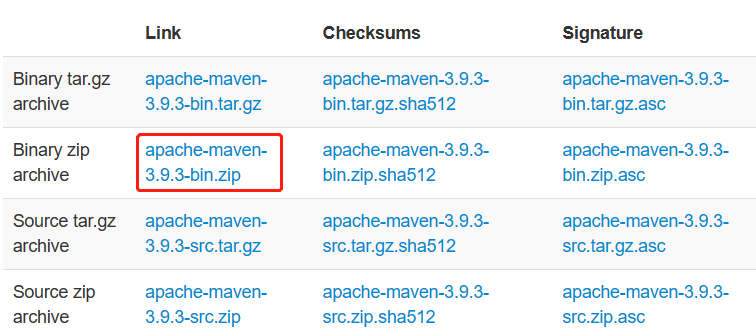
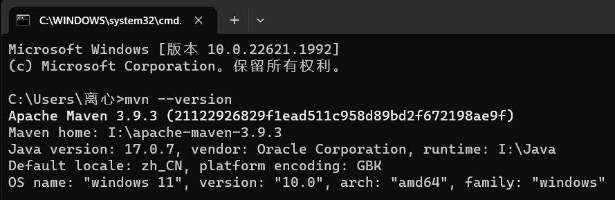
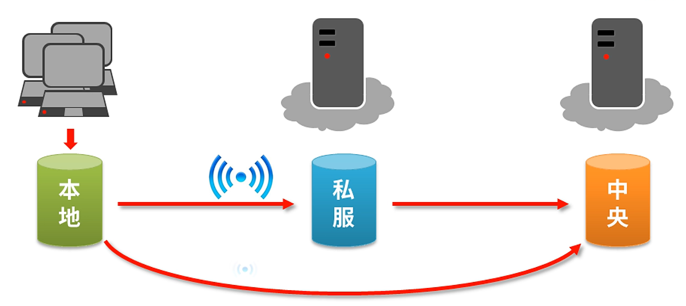

# Maven 入门教程

## Maven 结构与功能


## Maven 安装教程

首先，进入 Maven 官网下载页：https://maven.apache.org/download.cgi，如果是 windows 版本，直接下载 Binary zip archive 项目（点击下图所示位置）：



下载完成后得到一个压缩包，解压后是一个文件夹：apache-maven-3.9.3（版本号可能不同）。将这个文件夹放到自己选定的一个目录下，然后复制这个文件夹里的 bin 文件夹的地址，比如我的是：

```
I:/apache-maven-3.9.3/bin
```

然后打开 windows 搜索框，搜索“编辑系统环境变量”，点击“环境变量”，在系统变量的 path 项中进行编辑，添加刚刚复制的地址。

然后 win+R 打开 cmd 命令行，输入 `mvn --version`，出现类似下面的输出就说明安装好了：



此外，修改本地仓库地址和配置镜像等操作在下面伴随基础知识讲，避免读者云里雾里。

## Maven 基本概念

### Maven 仓库

仓库：仓库用于存储资源，资源可以理解为主要就是各种 jar 包。

#### 本地仓库、私服和中央仓库

- 本地仓库：在自己电脑上存储资源的仓库，可以连接远程仓库获取资源下载到本地。
- 远程仓库
  - 中央仓库：由 Maven 团队维护，用于存储所有资源的仓库。
  - 私服：部分/公司范围内存储资源的仓库，可以从中央仓库获取资源。

私服一般指私有服务器，它能够：

- 作为镜像存储中央仓库的资源。
- 保存具有版权的资源，包含自主研发或购买的 jar 包。
- 在内部共享资源，保存一些不对外开源的 jar 包。

本地仓库、私服和中央仓库的结构如下图所示：



### Maven 坐标

Maven 中使用坐标来描述一个资源（jar 包）在仓库中的位置。Maven 坐标由以下三个元素组成：

- `groupId`：定义当前 Maven 项目隶属的组织名，一般和域名反写，比如 `org.rucjava`。
- `artifactId`：定义当前 Maven 项目名称（通常是模块名称）。
- `version`：定义当前项目的版本号。

在下面这个网站可以查询到所有的 Maven 团队提供的 `jar` 包信息：`mvnrepository.com`

使用 Maven 坐标定位到一个资源以后，资源的识别和下载就自动地交给机器来完成。


